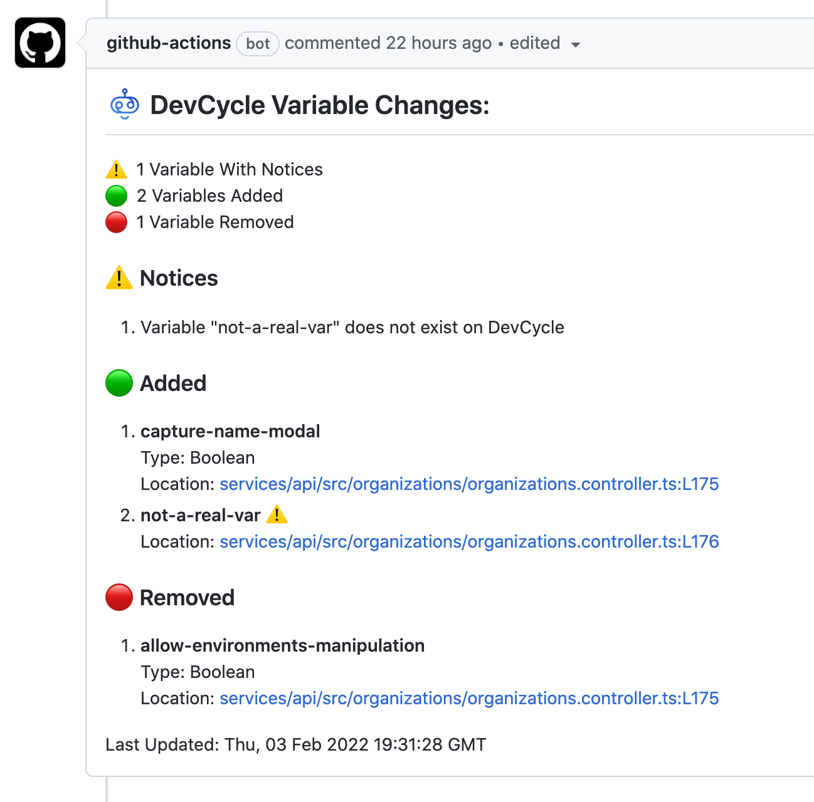

# DevCycle Feature Flag Insights for Pull Requests
With this Github action, information on which [DevCycle](https://devcycle.com/) features have been added or removed in a code change will be shown directly on each Pull Request as a comment.

Note: This is intended for `pull_request` workflow events

## Example Output


## Usage
Create a new Actions workflow in your GitHub repository (e.g. devcycle-insights.yml) in the .github/workflows directory. In your new file, paste the following code:

```yaml
on: pull_request

jobs:
  dvc-feature-flag-insights:
    runs-on: ubuntu-latest
    steps:
      - uses: DevCycleHQ/feature-flag-pr-insights-action@v1.0.0
        with:
          github-token: ${{ secrets.GITHUB_TOKEN }}
```

## Inputs

| input | required | description |
| ----- | -------- | ----------- |
| `github-token` | yes | The GitHub Actions token e.g. `secrets.GITHUB_TOKEN` |

## Configuration
This action uses the [DevCycle CLI](https://github.com/DevCycleHQ/cli) under the hood.
See the [CLI configuration](https://github.com/DevCycleHQ/cli#configuration) for details on how to setup a config file.